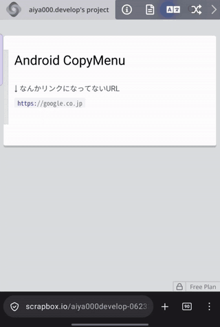
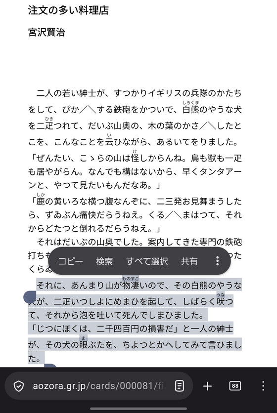
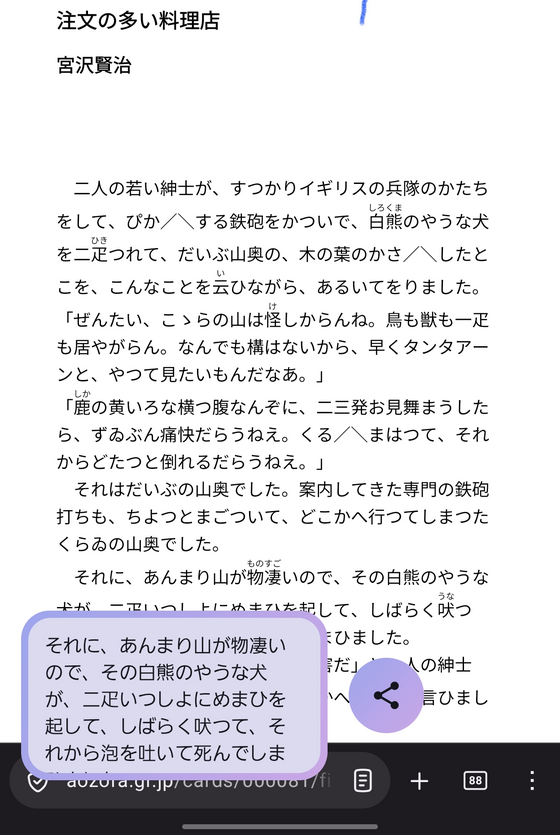
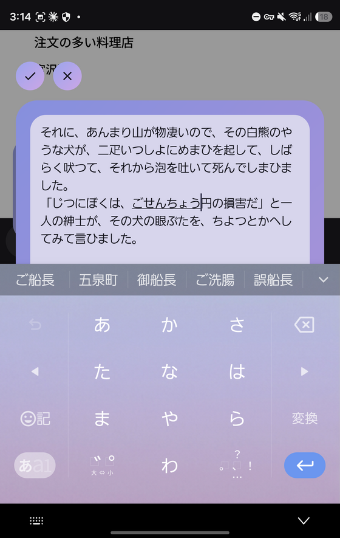
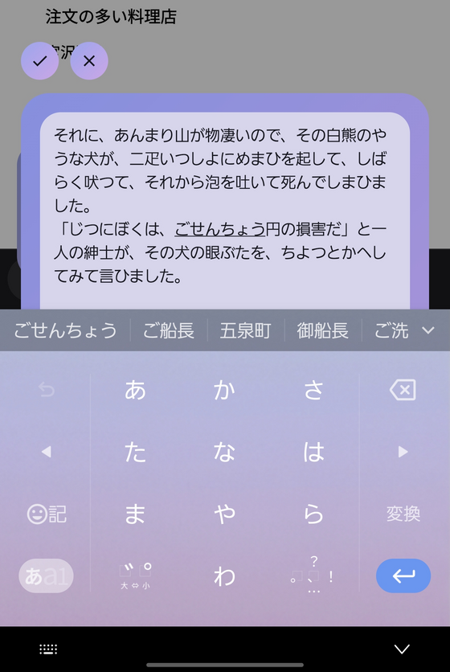
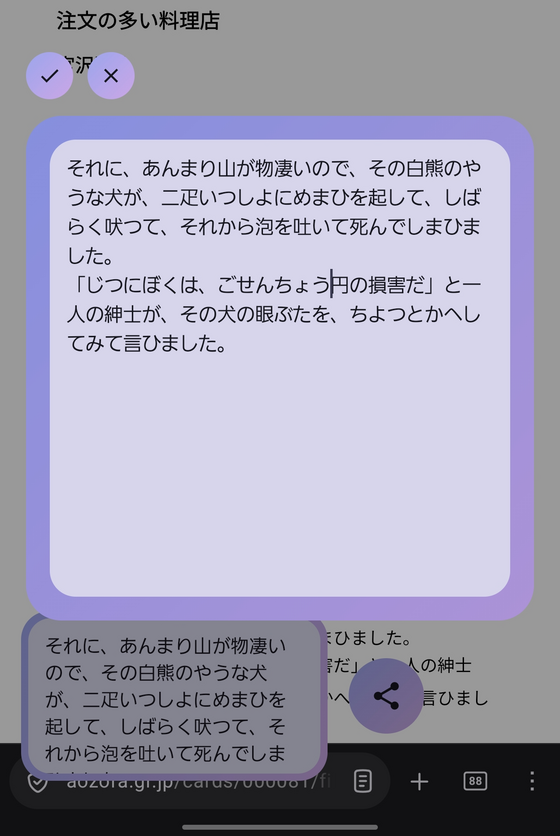
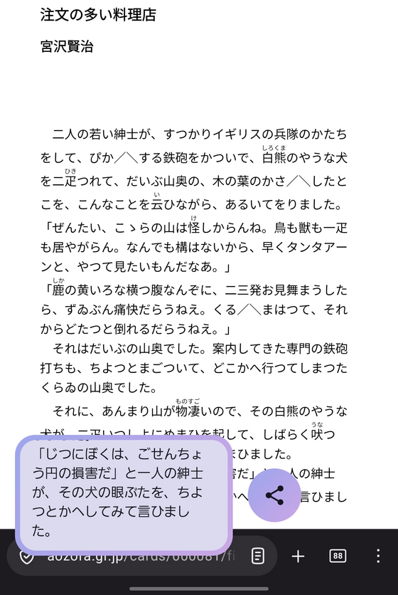
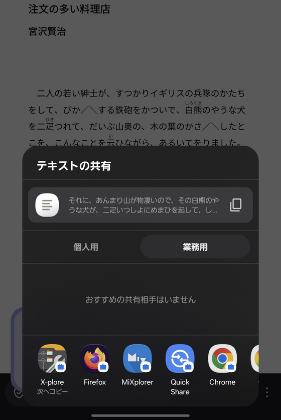

# PixelLike CopyMenu

A small Android app for editing and sharing what is on the clipboard, styled after the Pixel copy menu.

Launching it shows the copied text as a card in the bottom left corner, with a share button next to it.

## Demo

Copying a URL in another app, editing it in CopyMenu, and handing it to the system share sheet.



<sub>[video](docs/demo.mp4)</sub>

## Usage

<table>
  <tr>
    <td width="25%">1. Copy text in any app</td>
    <td width="25%">2. Launch CopyMenu: the clipboard text sits in the bottom left</td>
    <td width="25%">3. Tap the card to edit it</td>
    <td width="25%">4. The panel keeps its size while the keyboard is up</td>
  </tr>
  <tr>
    <td></td>
    <td></td>
    <td></td>
    <td></td>
  </tr>
  <tr>
    <td>5. With the keyboard down, the text area fills the panel again</td>
    <td>6. The check button confirms the edit and copies it</td>
    <td>7. The share button hands it to the system share sheet</td>
    <td></td>
  </tr>
  <tr>
    <td></td>
    <td></td>
    <td></td>
    <td></td>
  </tr>
</table>

The text in the screenshots is a passage of "The Restaurant of Many Orders" by Kenji Miyazawa (1896-1933), read from
[Aozora Bunko](https://www.aozora.gr.jp/cards/000081/card1927.html). Its copyright has expired.

## Features

- On launch, the current clipboard text is shown as a card. The card height is fixed, and text that does not
  fit scrolls inside it
- When the clipboard holds something that is not text, the app shows a toast and exits
- Tapping the card opens the editing panel. Tapping outside of the panel finishes the editing and copies the
  edited text to the clipboard
    - The check button confirms the edit, exactly like tapping outside
    - The close button discards the edit and closes the panel without copying
    - The panel keeps its size whether the keyboard is shown or not. The text area is padded at the bottom by
      the height the keyboard hides, so the last line can still be brought above the keyboard
- Tapping the share button opens the system share sheet with `Intent.ACTION_SEND`
- Tapping outside of the menu exits the app
- The app stays out of the recent apps list, so it does not sit between you and the app you came from.
  `MainActivity` declares `android:excludeFromRecents="true"`

## Layout

- Language: Kotlin
- UI: Jetpack Compose
- applicationId: `io.github.aiya000.pixellikecopymenu` (`.debug` is appended to the debug build)
- minSdk 26 / targetSdk 35 / compileSdk 35

```
app/src/main/kotlin/io/github/aiya000/pixellikecopymenu/
├── MainActivity.kt     -- reads the clipboard and hosts the screen
├── CopyMenuScreen.kt   -- the card and the share button
├── EditOverlay.kt      -- the editing panel
├── Clipboard.kt        -- clipboard and sharing helpers
└── Theme.kt            -- colors
```

## Building

Android Studio is not needed. An Android SDK (platform 35, build-tools) and JDK 17 are enough.

Point `local.properties` at the SDK.

```properties
sdk.dir=/path/to/Android/Sdk
```

With JDK 17 on `PATH`:

```console
$ ./gradlew :app:assembleDebug
```

This produces `app/build/outputs/apk/debug/app-debug.apk`.

When the JDK is managed by mise:

```console
$ mise exec java@17 -- ./gradlew :app:assembleDebug
```

## Installing

```console
$ adb install -r app/build/outputs/apk/debug/app-debug.apk
```

The debug build uses its own application id, so it installs next to the release build. It is the one with the
orange launcher icon, labelled `CopyMenu debug`.

The release build is unsigned, because the project declares no signing config. Sign it yourself before
installing it, for example with the Android debug keystore for a personal build.

## Notes

Since Android 10 (API 29), only the foreground app that holds the window focus may read the clipboard.
`MainActivity` therefore reads it in `onWindowFocusChanged`, not in `onCreate`.

## License

[MIT License](LICENSE)
